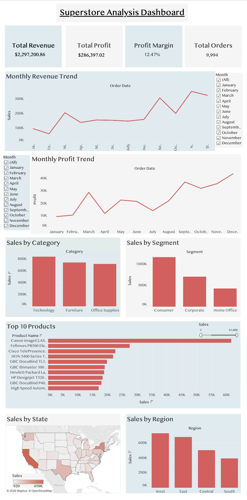

# Superstore-Data-Analysis

## Project Overview
Project analyzing retail sales data a Superstore dataset using Python, MySQL, and Tableau. The object was to identify sales trends, analyze customer behavior, and evaluate business performance. 

## Dataset
The data from this project is from Kaggle, **Superstore Dataset**.
**Source:** https://www.kaggle.com/datasets/vivek468/superstore-dataset-final

## Tools Used
* Python [Pandas, Matplotlib]
* MySQL
* Tableau

## Project Workflow
1. Data Cleaning [Python]
   * Imported and explored the data.
   * Checked for missing and duplicate values.
   * Data was converted into a usable format.
3. Initial Business Analysis [SQL]
   * Using MySQL to discover key business insights, including:
      * Total Revenue & Total Profit
      * Profit Margin
      * Revenue by Category
      * Top 10 Products by Revenue
      * States in Order & Top 10 States by Revenue
      * Top 10 Customers by Sale
      * Sales by Segment
      * Revenue & Profit by Category
5. Data Visualization [Python]
   * Created visualizations to analyze business performance, including:
      * Top 10 States by Revenue
      * Sales by Segment
      * Monthly Revenue & Monthly Profit
      * Revenue vs. Profit
      * Monthly Sales by Category
      * Monthly Profit Margin
      * Monthly Revenue vs. 3 Month Rolling Average
7. Interactive Dashboard [Tableau]
   * Build an interactive dashboard on Tableau with interactive filters, including:
      * KPI Cards:
          * Total Revenue
          * Total Profit
          * Profit Margin
          * Total Orders
      * Monthly Revenue Trend
      * Monthly Profit Trend
      * Sales by Category
      * Sales by Segment
      * Top 10 Products
      * Sales by State
      * Sales by Region

## Key Business Insights 
* Revenue generally increased over the four year period.
* There were noticeable spikes in Q4 and dips in Q1 consistently, suggesting seasonal fluctuations.
* Technology generated the highest in the product categories.
* The Consumer segment contributed the largest portion of total sales.

## Dashboard Preview:

* Tableau Public Link:
https://public.tableau.com/views/SuperstoreAnalysisDashboard_17833934117330/Dashboard1?:language=en-US&:sid=&:redirect=auth&:display_count=n&:origin=viz_share_link

